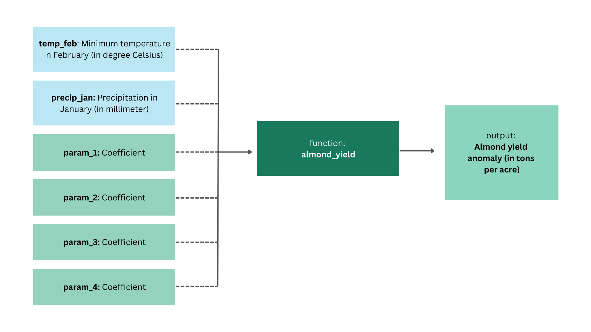

```{r setup, include = FALSE}
library(tidyverse)
library(purrr)
library(ggpubr)
library(kableExtra)
source("src/almond-yield.R", local = knitr::knit_global())
source("src/compute-revenue.R", local = knitr::knit_global())
```

## Conceptual Modeling

{width="534"}

## Application

Let's start by loading and tidying the data:

```{r}
# define column names
col_names <- c("day", "month", "year", "wy", "tmax_c", "tmin_c", "precip")

# load data frame with column names
clim <- read.table("src/clim.txt", header = TRUE, col.names = col_names)

# start data wrangling
clim_dat <- clim %>%
  # convert to numeric type 
  mutate(tmin_c = as.numeric(tmin_c),
         precip = as.numeric(precip)) %>% 
  # filter to relevant months of observation
  filter(month == c(1, 2)) 

# create temperature data frame 
temp_dat <- clim_dat %>%
  # filter to relevant month 
  filter(month == 2) %>%
  # group daily observations by year
  group_by(year) %>%
  # summarize for mean and minimum values  
  summarize(mean_tmin_feb = mean(tmin_c), 
            min_tmin_feb = min(tmin_c))

# create precipitation data frame 
precip_dat <- clim_dat %>% 
  # filter to relevant month 
  filter(month == 1) %>% 
  # group daily observations by year
  group_by(year) %>%
  # summarize for sum value
  summarize(sum_precip_jan = sum(precip))

# create final data frame 
dat <- left_join(temp_dat, precip_dat, by = "year")
```

And let's apply the function:

```{r}
almond_yield(temp_feb = dat$mean_tmin_feb, precip_jan = dat$sum_precip_jan)
```

```{r include = FALSE}
almond_yield_results <- almond_yield(temp_feb = dat$mean_tmin_feb, 
                             precip_jan = dat$sum_precip_jan)
```

Let's extract the minimum, mean, and maximum value of the list:

```{r}
# extract minimum yield anomaly value
min(almond_yield_results)

# extract mean yield anomaly value
mean(almond_yield_results)

# extract maximum yield anomaly value
max(almond_yield_results)
```

## Sensitivity Analysis

Next, let's do some informal sensitivity analysis on our parameters.

```{r}
# define param_1 from almond_yield function
param_1 <- as.numeric(-0.015)
# define param_3 from almond_yield function
param_3 <- as.numeric(-0.07)
```

### Parameter 1

```{r}
# create 300 samples of param_1
param_1_samples <- rnorm(mean = param_1, sd = 0.15, n = 300)

# use map() to apply function to the 300 samples 
almond_yield_param_1 <- param_1_samples %>% map(
  ~almond_yield(precip_jan = dat$sum_precip_jan, 
                temp_feb = dat$mean_tmin_feb, param_1 = .x))
```

```{r}
# create data frames by concatenating list as rows
sensitivty_dat_param_1 <- as.data.frame(do.call(rbind, 
                                        lapply(almond_yield_param_1, as.vector)))

# set column names as year
colnames(sensitivty_dat_param_1) <- as.character(dat$year)

# start data wrangling
sensitivty_dat_param_1 <- sensitivty_dat_param_1 %>% 
  # add param_1 samples as column
  mutate(param_1 = param_1_samples) %>%
  # relocate param_1 column before year columns
  relocate(param_1, .before = `1989`)

# pivot longer data frame
sensitivty_dat_param_1 <- sensitivty_dat_param_1 %>%
  pivot_longer(cols = !param_1, # select all columns except param_1
               names_to = "year", # pivot column names to year column
               values_to = "yield_anom") # pivot rows to yield_anom column
```

```{r}
# plot sensitivity of parameter 1
ggplot(sensitivty_dat_param_1, aes(year, yield_anom, group = year, col = year)) + 
  geom_boxplot(show.legend = FALSE) + 
  labs(y = "Almond Yield Anomalies (in ton per acre)",
       title = "Almond Yield Anomalies") +
  facet_wrap(~year, scales = "free", ncol = 4) +
  theme_classic() +
  theme(axis.title.x = element_blank()) 
```

### Parameter 3

```{r}
# create 300 samples of mean total precipitation in January
param_3_samples <- rnorm(param_3, sd = 0.15, n = 300)

# use map() to apply function to the 300 samples 
almond_yield_param_3 <- param_3_samples %>% map(
  ~almond_yield(temp_feb = dat$mean_tmin_feb, 
                precip_jan = dat$sum_precip_jan, param_3 = .x))
```

```{r}
# create data frames by concatenating list as rows
sensitivty_dat_param_3 <- as.data.frame(do.call(rbind,
                                        lapply(almond_yield_param_3, as.vector)))

# set column names as year
colnames(sensitivty_dat_param_3) <- as.character(dat$year)

# data wrangling
sensitivty_dat_param_3 <- sensitivty_dat_param_3 %>% 
  # add param_3 samples
  mutate(param_3 = param_3_samples) %>%
  # relocate param_3 column 
  relocate(param_3, .before = `1989`)

# pivot longer
sensitivty_dat_param_3 <- sensitivty_dat_param_3 %>% 
  pivot_longer(cols = !param_3,
               names_to = "year",
               values_to = "yield_anom_param_3")
```

```{r}
# plot sensitivity of parameter 3
ggplot(sensitivty_dat_param_3, 
       aes(year, yield_anom_param_3, group = year, col = year)) + 
  geom_boxplot(show.legend = FALSE) + 
  labs(y = "Almond Yield Anomalies (in ton per acre)",
       x = "Year", 
       title = "Almond Yield Anomalies") +
  theme_classic() +
  theme(axis.text.x = element_text(angle = 45, vjust = 0.3, hjust = 0.3)) 
```

### Almond Yield Model Uncertainty

Now, we combine uncertainty of parameters.

```{r}
# plot sensitivity for parameter 1
a <- ggplot(sensitivty_dat_param_1, 
            aes(year, yield_anom, group = year, col = year)) +
  geom_boxplot(show.legend = FALSE) + 
  labs(y = "Almond Yield Anomalies (in ton per acre)",
       x = "Year") +
  theme_classic() +
  theme(axis.text.x = element_text(angle = 45, vjust = 0.3, hjust = 0.3))

# plot sensitivity for parameter 3
b <- ggplot(sensitivty_dat_param_3, 
            aes(year, yield_anom_param_3, group = year, col = year)) + 
  geom_boxplot(show.legend = FALSE) + 
  labs(y = "Almond Yield Anomalies (in ton per acre)",
       x = "Year") +
  theme_classic() +
  theme(axis.title.y = element_blank(),
        axis.text.x = element_text(angle = 45, vjust = 0.3, hjust = 0.3)) 

ggarrange(a, b)
```

```{r warning = FALSE}
ggplot() + 
  geom_boxplot(data = sensitivty_dat_param_1, 
               aes(year, yield_anom, group = year), fill = "#f72585") +
  geom_boxplot(data = sensitivty_dat_param_3, 
               aes(year, yield_anom_param_3, group = year), 
               fill = "#4361ee", alpha = 0.5) +
  labs(y = "Almond Yield Anomalies (in ton per acre)",
       x = "Year") +
  theme(axis.text.x = element_text(angle = 45, vjust = 0.3, hjust = 0.3)) 

# 5 years that are outliers?
```

```{r warning = FALSE}
# To display variance in Parameter 1 and overlap with Parameter 3
ggplot() + 
  geom_boxplot(data = sensitivty_dat_param_1, 
               aes(year, yield_anom, group = year), fill = "#f72585") +
  geom_boxplot(data = sensitivty_dat_param_3, 
               aes(year, yield_anom_param_3, group = year), 
               fill = "#4361ee", alpha = 0.5) +
  labs(y = "Almond Yield Anomalies (in ton per acre)",
       x = "Year") +
  theme(axis.text.x = element_text(angle = 45, vjust = 0.3, hjust = 0.3)) +
  ylim(0, 20)
```

In 1991, variability in Parameter 1 versus variability in Parameter 3, caused more of an increase in the anomalies of almond production.

## Revenue Model

```{r}
revenue_anom <- compute_revenue(anom_almond_yield_results = almond_yield_results, 
                               years = dat$year)

revenue_anom <- revenue_anom %>%
  # relocate year column before anomaly columns
  relocate(year, .before = anom)

knitr::kable(revenue_anom, 
             caption = "Revenue for Almond Yield",
             col.names = c("Year", "Anomaly",
                           "Anomaly Revenue", 
                           "Total Revenue"), 
             digits = 3, 
             format.args = list(big.mark = ",", scientific = FALSE))
```
