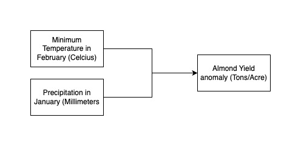

```{r setup, include = FALSE}
library(tidyverse)
library(purrr)
library(ggpubr)
source("src/almond-yield.R", local = knitr::knit_global())
```

## Conceptual Modeling



## Application

Let's start by loading and tidying the data:

```{r}
# define column names
col_names <- c("day", "month", "year", "wy", "tmax_c", "tmin_c", "precip")

# load data frame with column names
clim <- read.table("src/clim.txt", header = TRUE, col.names = col_names)

# start data wrangling
clim_dat <- clim %>%
  # convert to numeric type 
  mutate(tmin_c = as.numeric(tmin_c),
         precip = as.numeric(precip)) %>% 
  # filter to relevant months of observation
  filter(month == c(1, 2)) 

# create temperature data frame 
temp_dat <- clim_dat %>%
  # filter to relevant month 
  filter(month == 2) %>%
  # group daily observations by year
  group_by(year) %>%
  # summarize for mean and minimum values  
  summarize(mean_tmin_feb = mean(tmin_c), 
            min_tmin_feb = min(tmin_c))

# create precipitation data frame 
precip_dat <- clim_dat %>% 
  # filter to relevant month 
  filter(month == 1) %>% 
  # group daily observations by year
  group_by(year) %>%
  # summarize for sum value
  summarize(sum_precip_jan = sum(precip))

# create final data frame 
dat <- left_join(temp_dat, precip_dat, by = "year")
```

And let's apply the function:

```{r}
almond_yield(temp_feb = dat$mean_tmin_feb, precip_jan = dat$sum_precip_jan)
```

```{r include = FALSE}
yield_anom <- almond_yield(temp_feb = dat$mean_tmin_feb, precip_jan = dat$sum_precip_jan)
```

Let's extract the minimum, mean, and maximum value of the list:

```{r}
# extract minimum yield anomaly value
min(yield_anom)

# extract mean yield anomaly value
mean(yield_anom)

# extract maximum yield anomaly value
max(yield_anom)
```

## Sensitivity Analysis

Next, let's do some informal sensitivity analysis of our two parameters.

### Temperature Parameter

```{r}
# create 20 samples of temperature in February
temp_feb <- rnorm(mean = mean(dat$mean_tmin_feb), sd = 0.3, n = 20)

# use map() to apply function to the 20 samples 
almond_yield_temp <- temp_feb %>% map(
  ~almond_yield(precip_jan = dat$sum_precip_jan, temp_feb = .x))
```

```{r}
# create data frames by concatenating list as rows
sensitivty_dat <- as.data.frame(do.call(rbind, lapply(almond_yield_temp, as.vector)))

# set column names as year
colnames(sensitivty_dat) <- as.character(dat$year)

# start data wrangling
sensitivty_dat <- sensitivty_dat %>% 
  # add temp_feb samples as column
  mutate(temp = temp_feb) %>%
  # relocate temp column before year columns
  relocate(temp, .before = `1989`)

# pivot longer data frame
sensitivty_dat_longer <- sensitivty_dat %>%
  pivot_longer(cols = !temp, # select all columns except temp
               names_to = "year", # pivot column names to year column
               values_to = "yield_anom") %>% # pivot rows to yield_anom column
  filter(year %in% c(2001, 2002))
```

```{r}
# plot sensitivity of parameter
ggplot(sensitivty_dat_longer, aes(year, yield_anom, group = year)) + 
  geom_boxplot() + 
  labs(y = "Almond Yield Anomalies in ton per acre")

```

### Precipitation Parameter

```{r}
# create 20 samples of mean total precipitation in January
precip_jan <- rnorm(mean = mean(dat$sum_precip_jan), sd = 0.1, n = 20)

# use map() to apply function to the 20 samples 
```

```{r}
# create 20 samples of mean total precipitation in January
precip_jan <- rnorm(mean = mean(dat$sum_precip_jan), sd = 0.1, n = 20)

# use map() to apply function to the 20 samples 
almond_yield_precip <- precip_jan %>% map(
  ~almond_yield(temp_feb = dat$mean_tmin_feb, precip_jan = .x))

# create data frames by concatenating list as rows
sensitivty_dat_precip <- as.data.frame(do.call(rbind, lapply(almond_yield_precip, as.vector)))

# set column names as year
colnames(sensitivty_dat_precip) <- as.character(dat$year)

# data wrangling
sensitivty_dat_precip <- sensitivty_dat_precip %>% 
  # add precip_jan samples as column
  mutate(precip = precip_jan) %>%
  # relocate precip column 
  relocate(precip, .before = `1989`)

# pivot longer data frame
sensitivty_dat_precip_longer <- sensitivty_dat_precip %>% 
  pivot_longer(cols = !precip,
               names_to = "year",
               values_to = "yield_anom_precip")
```

```{r}
# plot sensitivity of precip parameter
ggplot(sensitivty_dat_precip_longer, aes(year, yield_anom, group = year)) + 
  geom_boxplot() + 
  labs(y = "Almond Yield Anomalies in ton per acre",
       title = "Almond Yield Anomalies based on January Precipitation\n")
```

### Almond Yield Model Uncertainty

Combine uncertainty

```{r}

```

## Profit Model

Let's now develop a profit model alongside our simple almond yield model.

\* you might assume a baseline profit and then adjust according to the anomaly  

\* there are many ways to combine the almond yield and profit functions; you can have the profit function "call"/use the almond yield function; or create a wrapper function that calls them in sequence (first the almond yield and then the profit function) 
